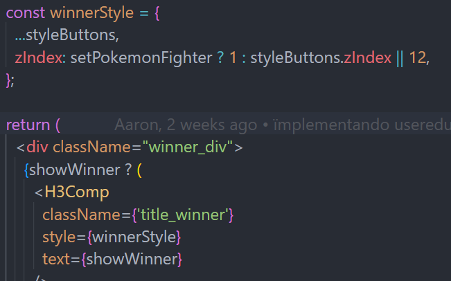

1 - Pantalla intermedia entre la pelea y el ganador, que se vea que realmente se están pegando.

2 - El texto de ENEMY WINS tiene que resetearse nada mas pulsar otra vez para que los pokemon se peleen.

3 - REVISA COMO QUITAR MANEJO DOM, EN WINNERRESULT, TIENES UN EJEMPLO DE COMO MANEJAR CON BOLEANOS EL DOM, CON WINNERSTYLE LO VES:

NOTAS A COMENTAR A SANTI:

- startFight: Lo he eliminado, era algo que usé en algún momento y acabé componetizando y exportando a otros sitios.